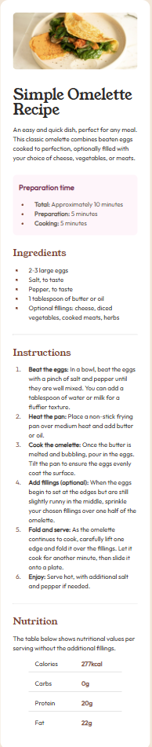
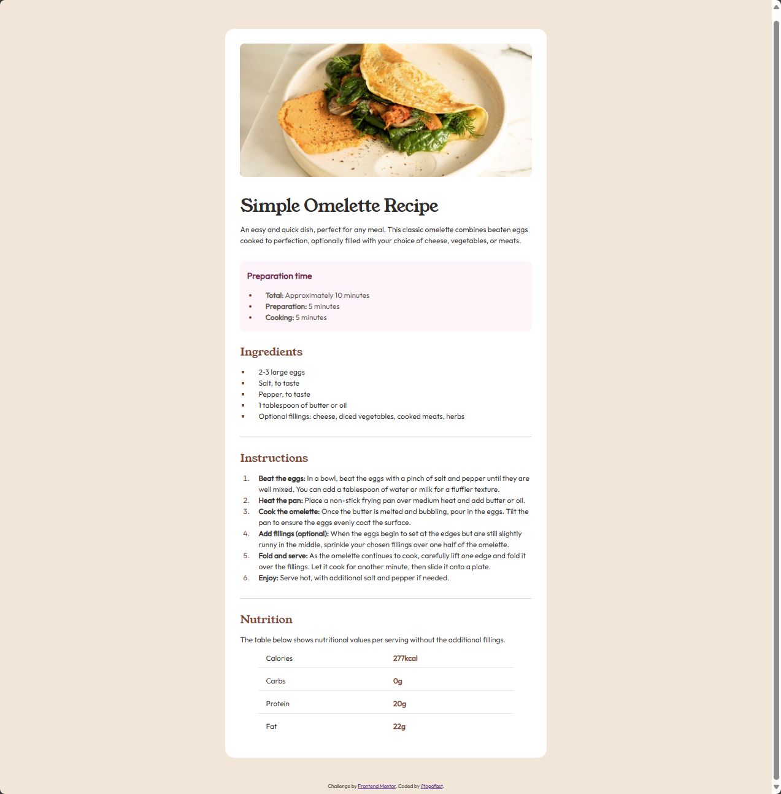

# Frontend Mentor - Recipe page solution

This is a solution to the [Recipe page challenge on Frontend Mentor](https://www.frontendmentor.io/challenges/recipe-page-KiTsR8QQKm). Frontend Mentor challenges help you improve your coding skills by building realistic projects. 

## Table of contents

- [Overview](#overview)
  - [Screenshot](#screenshot)
- [My process](#my-process)
  - [Built with](#built-with)
  - [What I learned](#what-i-learned)
  - [Continued development](#continued-development)
- [Author](#author)

## Overview

### Screenshot

 

## My process
I always just start with the HTML and get my page flow going and grouping everything into containers as needed, Then wrap up with the CSS.

### Built with

- Semantic HTML5 markup
- CSS 
- Flex
- CSS Grid

### What I learned

A better understanding of containers and using them to group elements that I want to style later on

### Continued development

I just need to keep practiicing and learn some more things with CSS. I usually brezze through the HTML portion

## Author

- Frontend Mentor - [@i1togofast](https://www.frontendmentor.io/profile/i1togofast)
